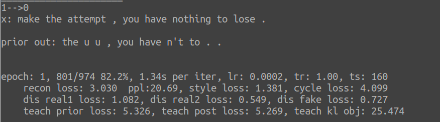

# StyIns
The source code of [*Text Style Transfer via Learning Style Instance Supported Latent Space*](https://xiaoyuanyi.github.io/papers/ijcai20_styins.pdf) (IJCAI 2020).

## 1. License
GPL-3.0

## 2. Requirements
* python>=3.7.0
* pytorch>=1.4.0
* nltk>=3.3

## 3. Data Preparation
To train the model and generate transferred sentences, please 

* segment each sentence into tokens and then convert each token into lowercase.  Note that we use a special symbol __NUM to represent digits both in training and testing;
* split the the unpaired corpus and the paired one (if available) into training and validation sets in json format, and then put them into the *StyIns/corpus/* directory. Put the testing input file into the *StyIns/inps/* directory. We provide some examples in these two directories. Note that for the paired validation json file, the first half of lines belong to one transfer direction (*e.g.*, negative->positive) and the other half of lines belong to the other direction (*e.g.*, positive->negative).

## 4. Training
In *StyIns/sources/*, run:
```
python train.py -t yelp
```

The parameter *-t* indicates the corpus and task. We provide two options: yelp and gyafc.

The source encoder, style encoder and decoder will be pre-trained as either a language model or a denoising seq2seq model, and then the StyIns model is trained based on the pre-trained one.

One can also edit *StyIns/sources/**config.py***  to modify the configuration, such as the hidden size, embedding size, number of instances, data path, training epoch, learning rate and so on. See the config.py for more details. 

During the training process, some training information is outputed, such as:

<div align=center></div>

The training and validation information is saved in the log directory, *e.g.*, StyIns/log/.

## 5. Generation
To generate transferred sentences, in *StyIns/sources/*, run:
```
python generate.py -t yelp
```

You can also use the parameter *-e* to specify the checkpont to be used, e.g., *-e 10* indicates using the checkpoint saved in the 10-th training epoch. If -e is not specified, the generation will take the latest checkpoint. The generated files are saved in the *StyIns/outs/* directory. *Note*: make sure you have put the input (source) file for testing in *StyIns/inps/*. See some provides example files in that directory for the format of these input files.

## 6. Model Output
We provide the outputs of StyIns in our original paper in StyIns/styins_outputs/.  
**Note**: since we convert each token into lowercase and use a special symbol __NUM to represent digits, when you directly use our output files to calculate some metrics like BLEU as your baseline results, make sure that you have processed the reference/target files in the same way.

## 7. Cite
When you use our source code / outputs, we will appreciate it if you could kindly cite our paper:

Xiaoyuan Yi, Zhenghao Liu, Wenhao Li and Maosong Sun. Text Style Transfer via Learning Style Instance Supported Latent Space. *In Proceedings of the Twenty-Ninth International Joint Conference on Artificial Intelligence*, pages 3081–3087, Yokohama, Japan, 2021.

The bib format is as follows:
```
@inproceedings{StyIns:20,
    author  = {Xiaoyuan Yi and Zhenghao Liu and Wenhao Li and Maosong Sun},
    title   = {Text Style Transfer via Learning Style Instance Supported Latent Space},
    year    = "2021",
    pages   = "3081--3087",
    booktitle = {Proceedings of the Twenty-Ninth International Joint Conference on Artificial Intelligence},
    address = {Yokohama, Japan}
}
```

## 9. Contact
If you have any questions, suggestions or bug reports, feel free to email yi-xy16@mails.tsinghua.edu.cn or mtmoonyi@gmail.com.


